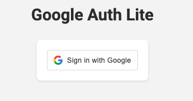
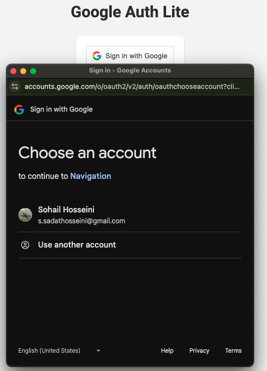
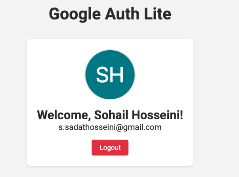

# Google Auth Lite

A lightweight authentication system using Google OAuth 2.0, built with React and Node.js. This project demonstrates secure user authentication using Google Sign-In, with a React frontend and Express.js backend.

## Screenshots

<p align="center">
  <br>
  <em>Login Screen</em>
</p>

<p align="center">
  <br>
  <em>Authentication Process</em>
</p>

<p align="center">
  <br>
  <em>Dashboard View</em>
</p>

## Features

- 🔐 Google OAuth 2.0 Authentication
- 🔑 JWT-based session management
- 🌐 React frontend with modern UI
- 🚀 Express.js backend
- 🛡️ CORS protection
- 🔒 Secure environment variable management

## Prerequisites

- Node.js (v14 or higher)
- npm or yarn
- Google Cloud Console account
- Google OAuth 2.0 credentials

## Project Structure

```
├── client/                 # React frontend
│   ├── src/               # Source files
│   ├── public/            # Static files
│   └── package.json       # Frontend dependencies
├── server/                # Express.js backend
│   ├── server.js          # Server entry point
│   └── package.json       # Backend dependencies
```

## Setup

### 1. Clone the repository

```bash
git clone <repository-url>
cd GoogleAuthLite
```

### 2. Install dependencies

```bash
# Install frontend dependencies
cd client
npm install

# Install backend dependencies
cd ../server
npm install
```

### 3. Configure Environment Variables

#### Frontend (.env in client directory)
```env
REACT_APP_GOOGLE_CLIENT_ID=your-google-client-id
```

#### Backend (.env in server directory)
```env
REACT_APP_GOOGLE_CLIENT_ID=your-google-client-id
CLIENT_URL=http://localhost:3000
JWT_SECRET=your-secure-jwt-secret-key
```

### 4. Google Cloud Console Setup

1. Go to the Google Cloud Console
2. Create a new project or select an existing one
3. Enable the Google+ API
4. Configure the OAuth consent screen
5. Create OAuth 2.0 credentials
6. Add authorized JavaScript origins:
   - http://localhost:3000
7. Add authorized redirect URIs:
   - http://localhost:3000

## Running the Application

### Start the backend server

```bash
cd server
npm start
# Server runs on http://localhost:5001
```

### Start the frontend application

```bash
cd client
npm start
# Client runs on http://localhost:3000
```

## Dependencies

### Frontend
- @react-oauth/google: ^0.11.0
- axios: ^1.4.0
- react: ^18.2.0
- react-dom: ^18.2.0
- react-router-dom: ^6.11.2

### Backend
- express: ^4.18.2
- cors: ^2.8.5
- dotenv: ^16.0.3
- google-auth-library: ^8.7.0
- jsonwebtoken: ^9.0.0

## Security

- Environment variables are used for sensitive data
- CORS is configured to only allow requests from the frontend
- JWT tokens are used for session management
- Google OAuth 2.0 ensures secure authentication

## Contributing

Contributions are welcome! Please feel free to submit a Pull Request.

## License

This project is licensed under the MIT License - see the [LICENSE](LICENSE) file for details.
